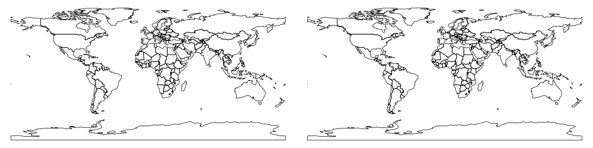
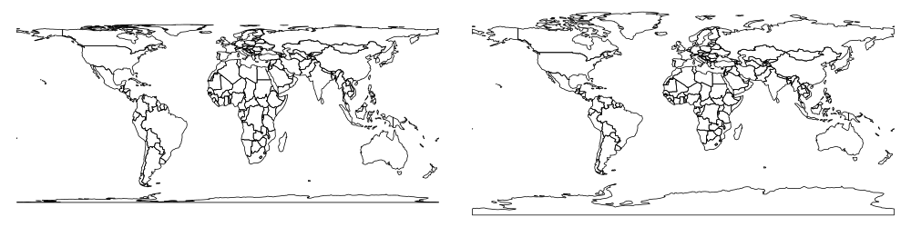
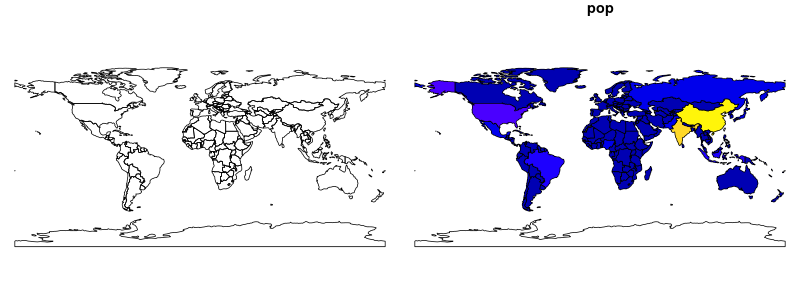
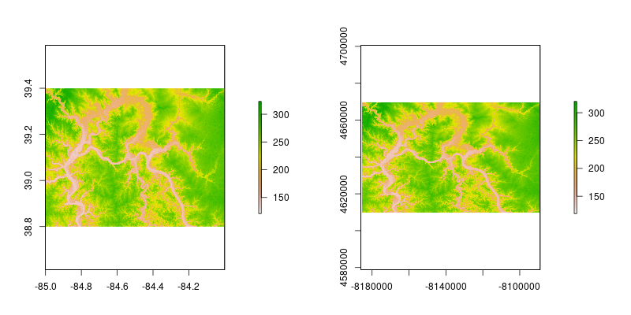

```{r setup, include=FALSE}
library(raster)
library(tidyverse)
library(sf)
options(htmltools.dir.version = FALSE)
```

## Introduction

- R has powerful GIS capabilities due to many additional packages - see [CRAN Task View: Analysis of Spatial Data](https://cran.r-project.org/web/views/Spatial.html) and [CRAN Task View: Handling and Analyzing Spatio-Temporal Data](https://cran.r-project.org/web/views/SpatioTemporal.html)
- **sf** and **sp** are the most important R packages to handle vector data; **sf** is a successor of **sp**, but it's still evolving. Moreover, many other R packages depend on the functions and classes for the **sp** package 
- **raster** is an extension of spatial data classes to work with rasters
- there are many ways to vizualize spatial data in R, for example **ggplot2**, **rasterVis**, **tmap**, **leaflet**, and **mapview** packages
- it is easy to connect R with a GIS software - GRASS GIS (**rgrass7**), SAGA (**RSAGA**), QGIS (**RQGIS**), and ArcGIS (**arcgisbinding**)

---
class: inverse, center, middle
## Vector data

---
## The **sf** package

The **sf** package in an R implementation of [Simple Features](https://en.wikipedia.org/wiki/Simple_Features). This package incorporates:
- a new spatial data class system in R
- functions for reading and writing data
- tools for spatial operations on vectors

Most of the functions in this package starts with prefix `st_`.

```{r, eval=FALSE}
devtools::install_github('edzer/sfr') # development version
```
or
```{r, eval=FALSE}
install.packages('sf') # stable version
```

You need a recent version of the GDAL, GEOS, Proj.4, and UDUNITS libraries installed for this to work on Mac and Linux. More information on that at https://github.com/edzer/sfr.

```{r, message=FALSE}
library('sf')
```

---
## Reading spatial data

```{r}
wrld <- st_read('data/wrld.shp')
```

```{r}
ham <- st_read('data/hamilton_county.gpkg')
```

---
## Reading spatial data - text files

```{r}
ham_cities <- read.csv('data/hamiltion_cities.csv')
```

```{r}
ham_cities_sf <- st_as_sf(ham_cities, coords = c("X","Y"))
ham_cities_sf
```

---
## Writing spatial data

```{r, warning=FALSE, results='hide', echo=FALSE}
file.remove(c('data/new_wrld.shp', 'data/new_wrld.gpkg'))
```

```{r, warning=FALSE}
st_write(wrld, 'data/new_wrld.shp')
```

```{r, warning=FALSE}
st_write(wrld, 'data/new_wrld.gpkg')
```

```{r, warning=FALSE, results='hide', echo=FALSE}
file.remove(c('data/new_wrld.shp', 'data/new_wrld.gpkg'))
```

---
## **sf** structure

```{r}
class(wrld)
```

**sf** objects usually have two classes - `sf` and `data.frame`. Two main differences comparing to a regular `data.frame` object are spatial metadata (`geometry type`, `dimension`, `bbox`, `epsg (SRID)`, `proj4string`) and additional column - typically named `geom` or `geometry`.

```{r}
wrld[1:2, 1:3]
```

---
## Attributes

- **sf** object can be used as a regular `data.frame` object in many operations

```{r, eval=FALSE}
head(wrld)
nrow(wrld)
ncol(wrld)
wrld[, c(1, 3)]
wrld[1:5, 2]
wrld[c(5, 10, 15), ]
```

- The `st_set_geometry` function can be used to remove the geometry column:

```{r}
wrld_df <- st_set_geometry(wrld, NULL)
class(wrld_df)
```

---
## Attributes - the **dplyr** package

- It also easy to use the **dplyr** package on `sf` objects:

```{r, message=FALSE}
library('dplyr')
```

- `select()`:

```{r}
wrld_sel <- select(wrld, name_long, area_km2)
```

```{r, echo=FALSE}
wrld_sel[1:4, ]
```

---
## Attributes - the **dplyr** package

- `arrange()`:

```{r}
wrld_arr <- arrange(wrld, area_km2)
```

```{r, echo=FALSE}
wrld_arr[1:3, ]
```

---
## Attributes - the **dplyr** package

- `filter()`:

```{r}
wrld_fil <- filter(wrld, pop < 297517)
```

```{r, echo=FALSE}
wrld_fil[1:3, ]
```

---
## Attributes - the **dplyr** package

- `mutate()`:

```{r}
wrld_mut <- mutate(wrld, pop_density = pop/area_km2)
```

```{r, echo=FALSE}
wrld_mut[1:3, ]
```

---
## Attributes - the **dplyr** package

- `summarize()`:

```{r}
wrld_sum1 <- summarize(wrld, pop_sum = sum(pop, na.rm = TRUE), 
                      pop_mean = mean(pop, na.rm = TRUE), 
                      pop_median = median(pop, na.rm = TRUE))
```

```{r, echo=FALSE}
wrld_sum1[1, ]
```

```{r}
wrld_sum1 <- wrld %>% 
        group_by(continent) %>% 
        summarize(pop_sum = sum(pop, na.rm = TRUE), 
                      pop_mean = mean(pop, na.rm = TRUE), 
                      pop_median = median(pop, na.rm = TRUE))
```

```{r, echo=FALSE}
wrld_sum1[1:3, ]
```

---
## CRS assign

- In case when a coordinate reference system (CRS) is missing or the wrong CRS is set, `st_crs()` or `st_set_crs` function can be used:

```{r, warning=FALSE}
wrld_set3410 <- st_set_crs(wrld, 3410)
st_crs(wrld_set3410)
```


```{r,echo=FALSE, eval=FALSE}
png('figs/coord_compare0.png', width = 1000, height = 250)
par(mfrow = c(1, 2), mar=c(0,0,0,0))
plot(wrld_set3410[0]);plot(wrld[0])
dev.off()
```



---
## CRS assign

```{r}
st_crs(ham_cities_sf)
```

```{r}
ham_cities_sf <- st_set_crs(ham_cities_sf, 4326)
st_crs(ham_cities_sf)
```

---
## Reprojection

- The `st_transform()` can be used to transform coordinates

```{r}
wrld_3410 <- st_transform(wrld, 3410)
st_crs(wrld_3410)
```

```{r,echo=FALSE, eval=FALSE}
png('figs/coord_compare.png', width = 1000, height = 250)
par(mfrow = c(1, 2), mar=c(0,0,0,0))
plot(wrld_3410[0]);plot(wrld[0])
dev.off()
```



---
## Basic maps

- Basic maps of `sf` object can be quickly created using the `plot()` function:

```{r, eval=FALSE}
plot(wrld[0])
```

```{r, eval=FALSE}
plot(wrld["pop"])
```

```{r, echo=FALSE, message=FALSE, warning=FALSE, results='hide'}
png('figs/plot_compare.png', width = 800, height = 300)
par(mfrow = c(1, 2), mar=c(0,0,1,0))
plot(wrld[0]);plot(wrld["pop"])
dev.off()
```




---
## The **sp** package

- the **sp** package is a predecessor of the **sf** package 
- together with the **rgdal** and **rgeos** package it creates a powerful tool to works with spatial data
- many spatial R packages still depends on the **sp** package, therefore it is important to know how to convert **sp** to and from **sf** objects

```{r}
wrld_sp <- as(wrld, 'Spatial')
class(wrld_sp)
wrld_sf <- st_as_sf(wrld_sp)
class(wrld_sf)
```


<!-- predesessor of sf-->
<!-- rgdal, rgeos-->
<!-- still used by many packages-->
<!-- how to convert (both ways)-->

---
class: inverse, center, middle
## Raster data

```{r, include=FALSE, eval=FALSE}
library('raster')
# getData('SRTM', lon=-8, lat=45, path='data')
# getData('SRTM', lon=-8, lat=40, path='data')
# dem <- raster('data/srtm_35_04.tif')
# system.time(plot(dem))
# system.time(image(dem))
# system.time(rasterVis::levelplot(dem))
# getData('SRTM', lon=-85, lat=40, path='data')
library('tigris')
library('sf')
library('tidyverse')
oh <- counties(state='OH')
ham <- oh %>% 
        st_as_sf(.) %>% 
        filter(NAME=='Hamilton')
plot(ham[0])
ham %>% st_write(., 'data/hamilton_county.gpkg')

dem <- raster('data/srtm_20_05.tif')


dem2 <- crop(dem, extent(-85, -84, 38.8, 39.4))
writeRaster(dem2, 'data/srtm.tif')
plot(dem2)
plot(ham, add = TRUE)
```

---
## The **raster** package

The **raster** package consists of method and classes for raster processing. It allows to:

- read and write raster data
- perform raster algebra and raster manipulations
- work on large datasets due to its ability to process data in chunks
- visualize raster data
- many more...

This package has three object classes:

- `RasterLayer` - for single-layer objects
- `RasterStack` - for multi-layer objects from separate files or a few layers from a single file
- `RasterBrick` - for multi-layer objects linked to a single file

<!-- raster info -->
<!-- old timer-->
<!-- three types of data -->

```{r, message=FALSE}
library('raster')
```

---
## Reading

```{r}
dem <- raster('data/srtm.tif')
dem
```

---
## Writing

```{r, warning=FALSE, results='hide', echo=FALSE}
file.remove(c('data/new_dem.tif', 'data/new_dem2.tif'))
```

```{r}
writeRaster(dem, 'data/new_dem.tif')
```


```{r}
writeRaster(dem, 'data/new_dem2.tif', 
            datatype = 'FLT4S', options=c("COMPRESS=DEFLATE"))
```

```{r, warning=FALSE, results='hide', echo=FALSE}
file.remove(c('data/new_dem.tif', 'data/new_dem2.tif'))
```

```{r}
writeFormats()
```

---
## **raster** structure

```{r}
dem
```

```{r}
inMemory(dem)
```

---
## Attributes

- the `getValues` function returns values from a raster object:

```{r}
values_dem <- getValues(dem)
```

```{r, echo=FALSE}
values_dem[1:50]
```

- it is possible to specify a number of rows to extract its values:

```{r, eval=FALSE}
getValues(dem, row = 5)
```

- there are two additional functions - `getValuesBlock` (to get a block of raster values) and `getValuesFocal` (to get focal raster cell values)

---
## Attributes

.pull-left[
```{r}
new_values <- runif(864000, min=150, max=300) # pseudo-random number generator
new_dem <- setValues(dem, new_values)
```

```{r, fig.align='center', fig.height=5, echo=FALSE}
plot(new_dem)
```
]

.pull-right[
```{r}
new_dem2 <- dem
new_dem2[new_dem2 < 0] <-  NA
```

```{r, fig.align='center', fig.height=5, echo=FALSE}
plot(new_dem2)
```
]

---
## Attributes

.pull-left[
```{r}
new_dem3 <- dem + 50
```

```{r, fig.align='center', fig.height=5, echo=FALSE}
plot(new_dem3)
```
]

.pull-right[
```{r}
new_dem4 <- dem * new_dem
```

```{r, fig.align='center', fig.height=5, echo=FALSE}
plot(new_dem4)
```
]

---
## CRS assign

```{r}
dem_set3410 <- dem
crs(dem_set3410) <- "+proj=cea +lon_0=0 +lat_ts=30 +x_0=0 +y_0=0 +a=6371228 +b=6371228 +units=m +no_defs"
```

```{r}
crs(dem_set3410)
```

---
## Reprojection

```{r}
dem3410 <- projectRaster(dem, crs="+proj=cea +lon_0=0 +lat_ts=30 +x_0=0 +y_0=0 +a=6371228 +b=6371228 +units=m +no_defs")
```

```{r,echo=FALSE, eval=FALSE}
png('figs/coord_compare_raster.png', width = 800, height = 400)
par(mfrow = c(1, 2), mar=c(4,4,4,8))
# par(mfrow = c(1, 2))
plot(dem);plot(dem3410)
dev.off()
```



---
## Simple map

```{r, fig.align='center'}
plot(dem)
```

---
class: inverse, center, middle
## Vector-Raster interactions

---
## Extract

```{r}
ham_cities_sp <- as(ham_cities_sf, 'Spatial')
raster::extract(dem, ham_cities_sp)
```

```{r}
ham_cities_sf$dem <- raster::extract(dem, ham_cities_sp)
ham_cities_sf
```

---
## Crop

```{r, echo=FALSE, message=FALSE}
library('tigris')
oh <- counties(state='OH')
ham0 <- oh %>% 
        st_as_sf(.) %>% 
        filter(NAME=='Hamilton')
ham <- st_transform(ham0, 4326)
```

```{r}
ham84 <- st_transform(ham, 4326)
ham_sp <- as(ham84, 'Spatial')
```

.pull-left[ 
```{r}
dem_crop <- crop(dem, ham_sp)
```

```{r, echo=FALSE}
plot(dem_crop)
```
]

.pull-right[ 
```{r}
dem_mask <- mask(dem_crop, ham_sp)
```

```{r, echo=FALSE}
plot(dem_mask)
```
]

---
class: inverse, center, middle
## Advanced map-making

---
## rasterVis

- https://oscarperpinan.github.io/rastervis/
- http://www.colorbrewer.org

```{r, message=FALSE, fig.align='center', fig.height=4}
library('rasterVis')
my_theme <- rasterTheme(region=brewer.pal('RdYlGn', n = 9))
p <- levelplot(dem_crop, margin = FALSE, par.settings = my_theme)
p <- p + layer(sp.lines(ham_sp, lwd = 3, col = 'darkgrey'))
p + layer(sp.points(ham_cities_sp, pch = 19, col = 'black'))
```

---
## tmap

- https://cran.r-project.org/web/packages/tmap/vignettes/tmap-nutshell.html

```{r, fig.align='center', fig.height=4}
library('tmap')
tm_shape(wrld, projection="wintri") +
        tm_polygons("lifeExp", style="pretty", palette="RdYlGn",
                    auto.palette.mapping=FALSE, title=c("Life expactancy")) +
        tm_style_grey()
```

---
## leaflet

```{r, eval=FALSE}
library('leaflet')
leaflet(ham_sp) %>%
        addProviderTiles(providers$Stamen.Watercolor) %>% 
        # addTiles() %>%
        addPolygons() %>% 
        addMarkers(data=ham_cities_sp, popup=~as.character(name))
```

```{r, echo=FALSE, message=FALSE}
library(widgetframe)
library('leaflet')
frameWidget(l, height = '400')
```

---
class: inverse, center, middle
## Spatial data sources

---
## Spatial data sources

- [The osmdata package](https://github.com/osmdatar/osmdata) - for downloading OpenStreetMap data
- [The tigirs package](https://github.com/walkerke/tigris) - Census TIGER/Line shapefiles in R 
- [The USAboundaries package](https://github.com/ropensci/usaboundaries/) - contemporary state, county, and congressional district boundaries for the United States of America, as well as historical boundaries from 1629 to 2000 for states and counties
- [The rnaturalearth package](https://github.com/ropenscilabs/rnaturalearth) -  Natural Earth map data
- [The MODIStsp package](https://github.com/lbusett/MODIStsp) - automatic download and preprocessing of MODIS Land Products Time Series
- [The rWBclimate](https://github.com/ropensci/rWBclimate) - the World Bank climate data
- [The GSODR package](https://github.com/ropensci/GSODR) - Global Summary Daily Weather Data
- [The rnoaa package](https://github.com/ropensci/rnoaa/) - an R interface to many NOAA data sources
- [The hddtools package](https://github.com/ropensci/hddtools/) - Hydrological Data Discovery Tools
- [The spData package](https://github.com/Nowosad/spData) - datasets for spatial analysis

---
class: inverse, center, middle
## Resources

---
## Resources

- [sf vignette](https://edzer.github.io/sfr/articles/) - documentation of the **sf** package
- [HOW-TO: Mapping in R just got a whole lot easier](http://www.computerworld.com/article/3175623/data-analytics/mapping-in-r-just-got-a-whole-lot-easier.html) - an introduction to mapping using the sf package
- [Spatial analysis in R with the sf package](https://cdn.rawgit.com/rhodyrstats/geospatial_with_sf/bc2b17cf/geospatial_with_sf.html) -  an introduction to spatial analysis using the sf package
- [Tidy spatial data in R: using dplyr, tidyr, and ggplot2 with sf](http://strimas.com/r/tidy-sf/) 
- [Introduction to Working With Raster Data in R](http://neondataskills.org/tutorial-series/raster-data-series/) - a series of introductory tutorials to the **raster** package
- [Map and analyze raster data in R](http://zevross.com/blog/2015/03/30/map-and-analyze-raster-data-in-r/) - examples of how to work with raster data in R 
- [The Visual Raster Cheat Sheet](http://rpubs.com/etiennebr/visualraster) - great illustrations of some operations of the **raster** package
- [Introduction to rasterVis](https://rpubs.com/alobo/rasterVis_Intro1)
- [Leaflet for R](http://rstudio.github.io/leaflet/)  - documentation of the **leaflet** package
- [Spatial Data Analysis and Modeling with R](http://rspatial.org/index.html) - materials to learn about spatial data analysis and modeling with R
- [Creating-maps-in-R](https://github.com/Robinlovelace/Creating-maps-in-R) - introductory tutorial on graphical display of geographical information in R
- [Downloading and plotting MODIS Chlorophyll-a data](http://clarkrichards.org/r/oce/modis/chl/sp/raster/2017/03/25/modis-chl-data/)

<!-- our book?? -->

